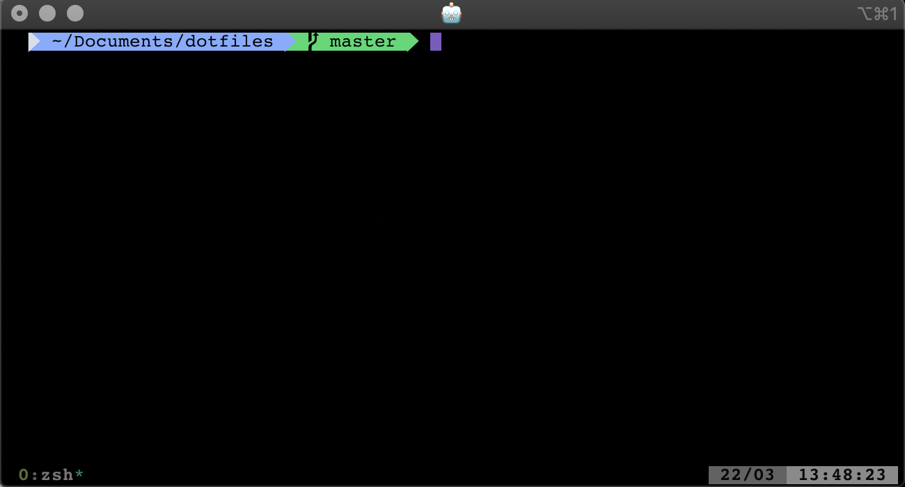

# Custom DotFiles
This repository contains my own customization for vim, oh-my-zsh & tmux, hope this will be usefull. 👨🏻‍💻

Requierements: 
  1. Install iterm2. 
  2. Install Tmux.
  3. Install vim if you don't have it.
  4. I'm using Meslo Fonts.
  
Colours: I'm using iterm2-night-owl.

Iterm2 configs:
