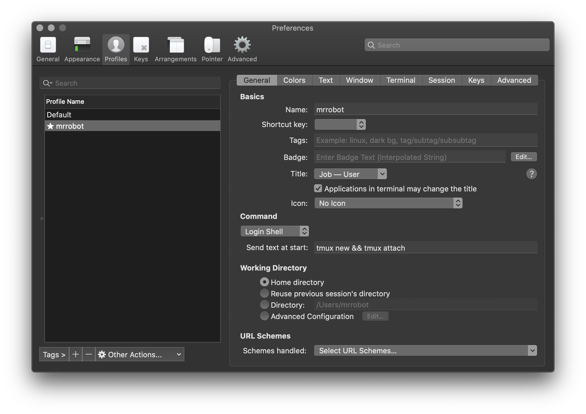
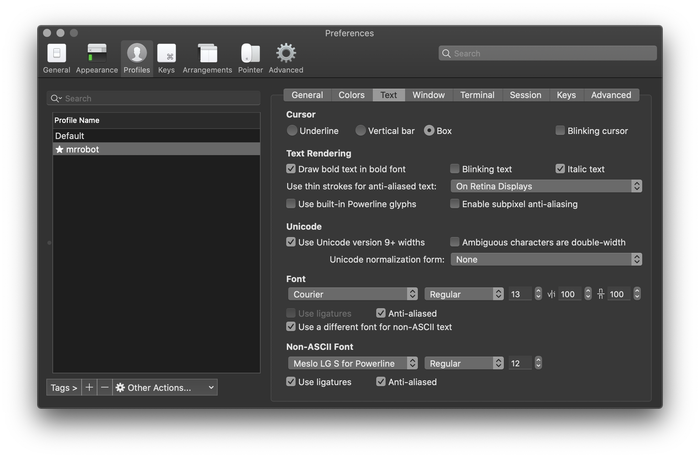
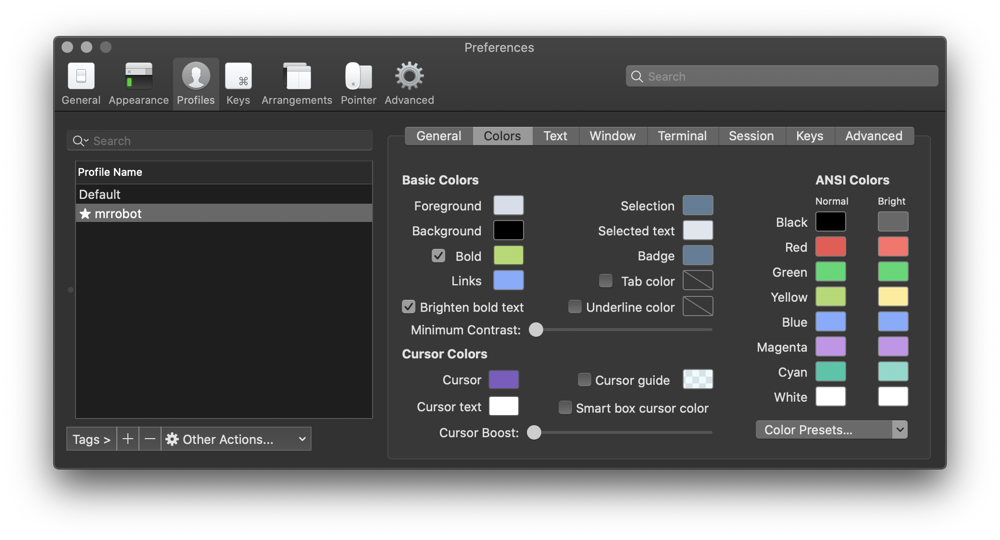
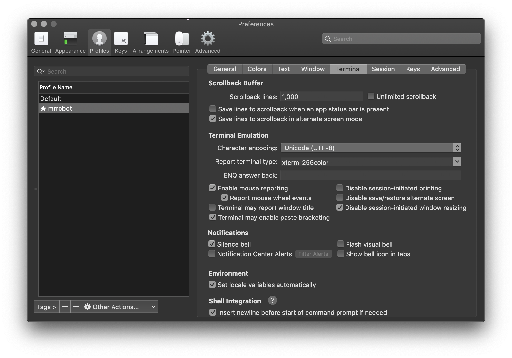

# Custom DotFiles
This repository contains my own customization for vim, oh-my-zsh & tmux. I hope this will be usefull for you. 👨🏻‍💻

## Recom:
Install and use brew. 

## Requierements: 
  1. Install iterm2. 
  2. Install Tmux.
  3. Install vim if you don't have it.
  4. I'm using Meslo Fonts, download and install it.
  
## Iterm2 configs:
### General

### Text

### Colours

### Terminal

